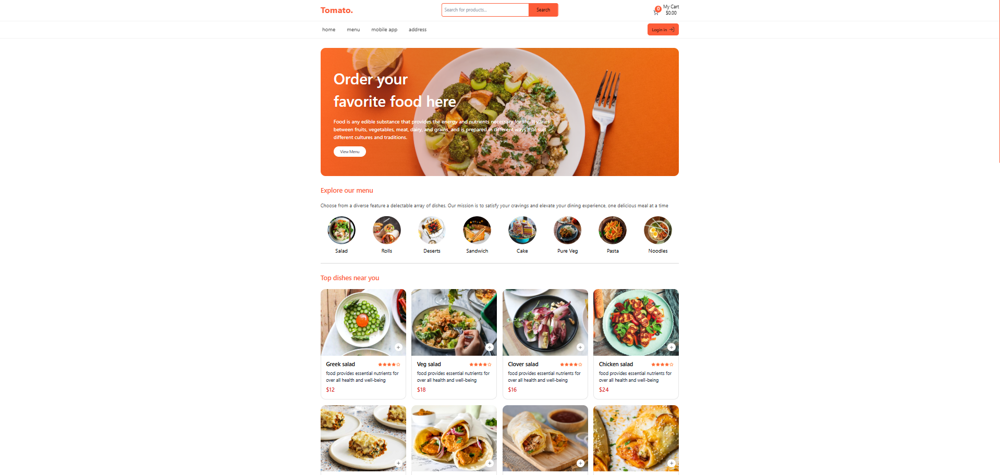

# 🛒 E-commerce Shopping Cart Web App

> Web App built with Html + Vite.js + JavaScript + TailwindCSS + JSONBin  
> تجربة تسوّق إلكتروني متكاملة⚡



---

## 🔍 Overview

ده مشروع ويب لعربة تسوق إلكترونية بواجهة مستخدم وبيقدم تجربة استخدام كامله من اول تصفح المنتجات لحد تسجيل الدخول

- ⚡ مبني باستخدام Vite.js لسرعة التطوير
- 🎨 TailwindCSS لتصميم واجهة عصرية وسريعة الاستجابة
- 🛠️ JSONBin لتخزين البيانات بدون Backend

---

## ✨ Features

| الميزة | الوصف |
|--------|-------|
| 🔎 **البحث عن المنتجات (Search Products)** | تقدر تبحث عن المنتجات باستخدام اسم كل منتج بتكتب الاسم وبيطلع اسم المنتج الي انت بتدور عليه |
| 📦 **عرض تفاصيل المنتج (Product Details)** | لما ادوس علي اسم اي منتج بيتعرض في صفحة بتحتوي على كافة التفاصيل (اسم، سعر، صورة، وصف) |
| ➕ **إضافة إلى العربة (Add to Cart)** | تقدر تضيف المنتج إلى العربة بضغطة واحدة بس مع عرض عدد وسعر العناصر |
| 🔁 **زيادة أو تقليل الكمية (Increment/Decrement)** | تستخدم في انك بتحدد الكميه بتاعه كل منتج انت عايزوا تقدر تقلل الكميه وتزود الكميه وكل دا بيسمع في صفحه ال shopping cart  |
| 🔐 **تسجيل الدخول/تسجيل الخروج (sign In/out)** | إنشاء حساب جديد (Sign Up) تسجيل الدخول (Sign In)، وتسجيل الخروج (Log Out)، مع واجهة بسيطة وسهلة الاستخدام |
| 🧼 **فلترة المنتجات (Filter Products)** | عامل فلتر علي كل منتج ب استخدام ال query params ف بيجبلي المنتجات الخاصه ب الحاجه دي |
| ☁️ **JSONBin API** | ربط البيانات المنتجات والعربة وكل البيانات وعرضها في المشروع |

---

## 🧪 Tech Stack

- **Frontend:** HTML5, Vite.js, JavaScript
- **Styling:** TailwindCSS
- **Storage:** JSONBin API (No Backend Required)

---

## 🚀 Installation & Setup

```bash
# 1. Clone the repo
git clone https://github.com/islam-rabia/E-commerce-Tomato.git

# 2. Go to project directory
cd E-commerce-Tomato

# 3. Install dependencies
npm install

# 4. Run the dev server
npm run dev
