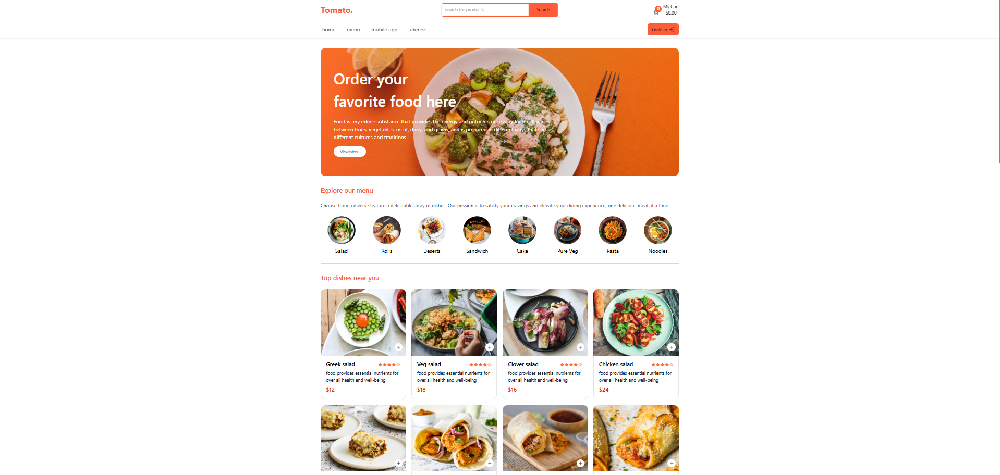

# 🛒 E-commerce Shopping Cart Web App

> Web App built with Html + Vite.js + JavaScript + TailwindCSS + JSONBin  
> تجربة تسوّق إلكتروني متكاملة⚡



---

## 🔍 Overview

ده مشروع ويب لعربة تسوّق إلكترونية بيقدّم تجربة متكاملة للمستخدم:
من تصفّح المنتجات، الفلترة، إضافة منتجات للعربة، لحد تسجيل الدخول وإتمام الطلب.

- ⚡ مبني باستخدام Vite.js لسرعة التطوير
- 🎨 TailwindCSS لتصميم واجهة عصرية وسريعة الاستجابة
- 🛠️ JSONBin لتخزين البيانات بدون Backend

---

## ✨ Features

| الميزة | الوصف |
|--------|-------|
| 🔎 **البحث عن المنتجات** | شريط بحث يسهّل على المستخدم الوصول لأي منتج |
| 📦 **تفاصيل المنتج** | عرض معلومات المنتج بالكامل بصورة جذابة |
| ➕ **إضافة للعربة** | إضافة المنتج ومتابعة السعر والعدد تلقائيًا |
| 🔁 **تحكم بالكمية** | زيادة أو تقليل الكمية مباشرة من صفحة العربة |
| 🔐 **تسجيل الدخول / الخروج** | نظام بسيط لتسجيل الدخول وإنشاء حساب |
| 🧼 **فلترة المنتجات** | فلترة حسب النوع أو القسم باستخدام URL Parameters |
| ☁️ **JSONBin API** | حفظ واسترجاع بيانات المنتجات والعربة |

---

## 🧪 Tech Stack

- **Frontend:** HTML5, Vite.js, JavaScript
- **Styling:** TailwindCSS
- **Storage:** JSONBin API (No Backend Required)

---

## 🚀 Installation & Setup

```bash
# 1. Clone the repo
git clone https://github.com/islam-rabia/E-commerce-Tomato.git

# 2. Go to project directory
cd E-commerce-Tomato

# 3. Install dependencies
npm install

# 4. Run the dev server
npm run dev
